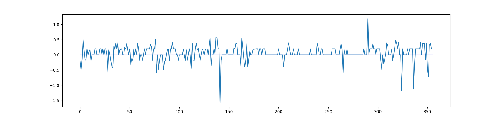
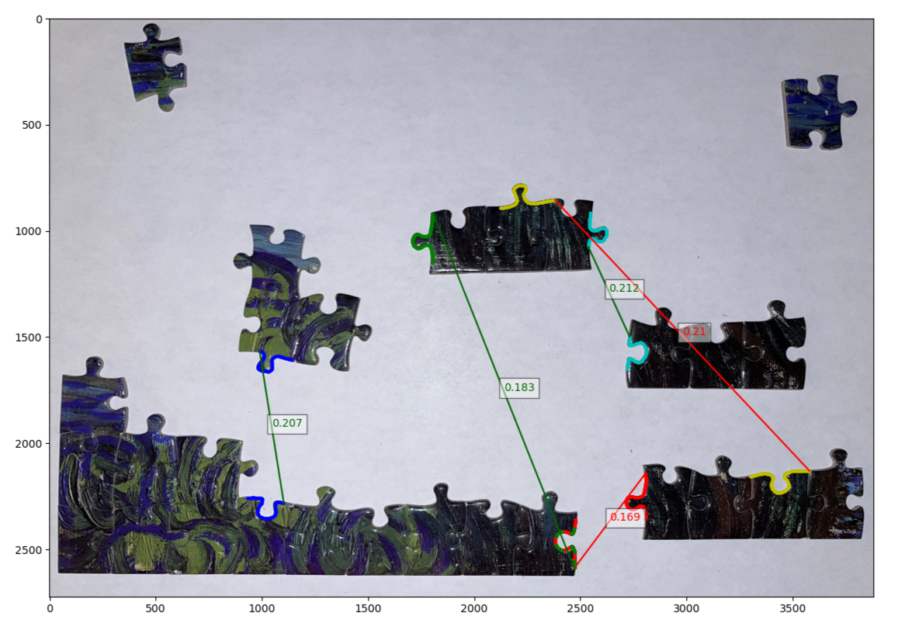

# PowerfulPuzzling
## Abstract

The Powerful Puzzling algorithm aims to provide a solution to jigsaw puzzle solvers that are able to work with island pieces (a group of two or more connected pieces); unlike current solutions that require a fully disassembled puzzle in order to work . This makes for a more practical approach to puzzle solving that allows players the satisfaction of completing the puzzle by not requiring disassembly. The main idea behind the Powerful Puzzling algorithm that makes it work for islands is the unrolling of border contours into a 1D strip that can be segmented up and compared with other strips to find matches. This allows us to work in 1 dimension and not have to worry about performing brute force rotations and translations to get pieces to match . The main  Powerful Puzzling algorithm also uses Dynamic Time Warping (DTW) for both shape and color matching and combines the results to get a final match score. We found that when we apply a weighting of (2,1) for the shape and color score, respectively, we got the best performance with 3 out of the top 5 matches being correctly identified. The algorithm also introduces some high level filters that improve performance allowing the entire program to run in under 3s (1.5s for just matching).

## Figures (rest of paper to be added soon)
||
|:-------------------------:|
|***Figure 6**: The step by step process of the MRCNNs mask generation*|

|
|:-------------------------:|
|***Figure 8**: A visual representation of what the border unrolling algorithm extracts from the border to represent it as a 1D array. This was done using the [Desmos online graphing calculator](https://www.desmos.com/calculator/4rtapddrqv).*|

|
|:-------------------------:|
|
|
***Figure 9**: Plots showing what the unrolling algorithm does to the border. Top: the original border. Middle: the unrolled border with a sampling rate of 25. Bottom: the unrolled border with a sampling rate of 10.*

||
|:-------------------------:|
|***Figure 10**: a plot of the ratios of line points to non-line points with x markers for the peaks that are identified by SciPy’s `find_peaks_cwt()` function .*|

||
|:-------------------------:|
***Figure 11**: GIF illustrating the entire lock identification process. Red and yellow points indicate the “line” and “non-line” points of the border. Lock segments are highlighted in green with a red + sign indicating its start, and a blue X indicating where it ends.*

||
|:-------------------------:|
|***Figure 12**: Visualization of how DTW works for when comparing a segment of the sine and cosine graphs.*|

||
|:-------------------------:|
|***Figure 13**: a GIF, [created using Desmos](https://www.desmos.com/calculator/o2g7m3odhg), illustrating how two sampled points from the border (points A and B) can be used to find a third point (c) that is orthogonal from the border and at a fixed distance* $d_{ist}$.|

|
|:-------------------------:|
|
|
|***Figure 14**: The final output of the Powerful Puzzling algorithm under different score weightings for shape and color. Here we can see the top 5 matches it found along with their match score (the lower the better). lines in green indicate correctly identified matches. Top: a weighting of (0,1) for shape and color respectively. Middle: a weighting of (1,0). Bottom: a weighting of (2,1).*|
---

## Running a test:
Start the project by running `run.py`.